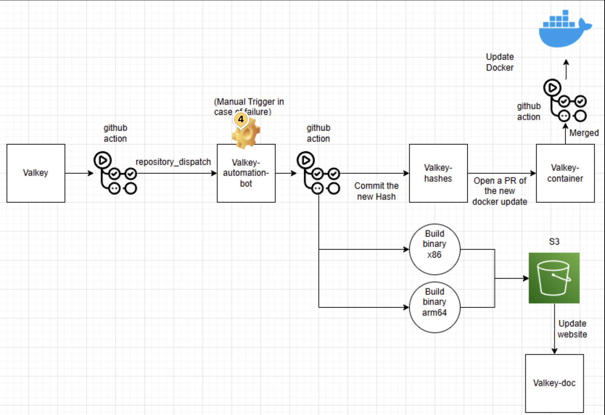
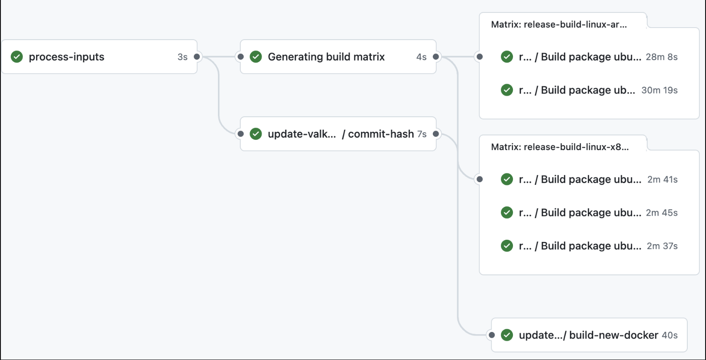

# Overview
This bot will automate post-release processes for each new release of Valkey. The tasks automated include building the official binaries and uploading them to the S3 bucket, updating the valkey-hashes repository, updating the valkey-container and uploading the docker image, and finally updating the valkey.io website downloads page with the new releases. This bot will be triggered whenever a new release is published.

Here is a diagram that depicts the automated release process: <br>


# Workflow
The workflow `trigger-build-release.yml` in the valkey-io/valkey repository will trigger this automation bot whenever a new release is published. The workflow will send the version and the environment as the payload. Additionally, the workflow will require a Personal Access Token which we will describe how to set up below. Once the workflow is triggered, this bot will process the payload and run the following: <br>
 <br>
We now have a unified workflow that will handle all the steps in the release process.

# Authentication Setup

This guide describes the steps to set up authentication tokens required for the post-release tasks in Valkey.

## 1. Set up a PAT Token in Github Secrets
Create a Personal Access Token (PAT) with the following permissions:
- **Actions:** Read and Write (To trigger and interact with github actions)
- **Contents:** Read and Write (To access repository contents and modify them)
- **Metadata:** Read-only (To access repository metadata)
- **Workflows:** Read and Write (To trigger workflows in the automated bot repository)
Add this token as a secret in your repository (ex: `PAT_TOKEN`).

## 2. Set up the S3 Buckets and add Tokens on GitHub Secrets
### a. **Create 2 S3 Buckets:**  
- A production bucket: `valkey-s3-prod-bucket`
- A testing bucket: `valkey-s3-test-bucket`
### b. **Add Bucket Names as Secrets**  
- Create a secret named `AWS_TEST_BUCKET` with the value `valkey-s3-test-bucket`.
- Create a secret named `AWS_S3_BUCKET` with the value `valkey-s3-prod-bucket`.<br>
**Note:** These secret names have to be these exact values because they'll correspond to variables in the code.

## 3. Set up OIDC and IAM Role for GitHub Actions
### a. Create an Identity provider with OpenID Connect in AWS
- Go to the AWS IAM Console and select Identity Providers
- Click add provider and choose OpenID Connect
- Set the Provider URL: `https://token.actions.githubusercontent.com`
- Set the Audience: `sts.amazonaws.com`

### b. Create an IAM Role for GitHub Actions
- In the AWS IAM Console navigate to Roles and then select Create role.
- Select web identity as the trust entity type
- Choose the OIDC provider that we created.
 - Set the audience to `sts.amazonaws.com`.
- Edit the trust policy with:
    ```{
        "Version": "2012-10-17",
        "Statement": [
            {
                "Effect": "Allow",
                "Principal": {
                    "Federated": "arn:aws:iam::<aws_account_id>:oidc-provider/token.actions.githubusercontent.com"
                },
                "Action": "sts:AssumeRoleWithWebIdentity",
                "Condition": {
                    "StringLike": {
                        "token.actions.githubusercontent.com:sub": [
                            "repo:valkey-io/valkey:ref:refs/heads/unstable",
                            "repo:valkey-io/valkey:ref:refs/tags/*"
                        ],
                        "token.actions.githubusercontent.com:aud": "sts.amazonaws.com"
                    }
                }
            }
        ]
        }```
**Note:** Remember to replace `<aws_account_id>` with your actual aws account id.
### c. Create a secret named `AWS_ROLE_TO_ASSUME`
- The secret value for this token is the arn of the IAM role that you just created.
