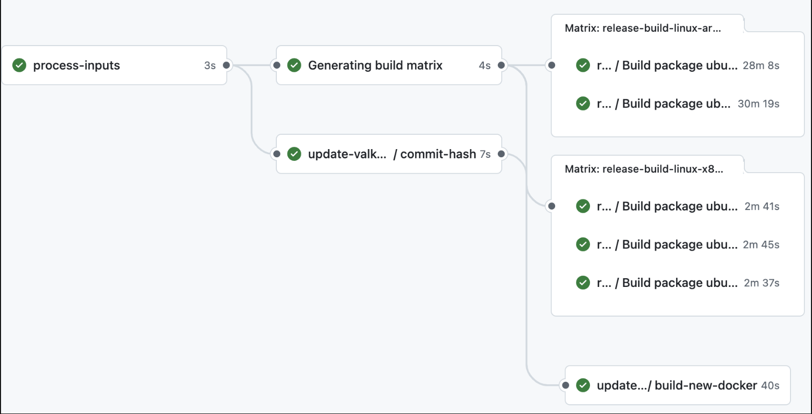

# Overview
This repository automates all the post-release processes for a new Valkey version release. The tasks undertaken by the this bot include building the official binaries and uploading them to the S3 bucket, updating the valkey-hashes repository, opening a PR on the valkey-container, and finally updating the valkey.io website with a download page for a new version.

Here is a diagram that depicts the automated release process: <br>


# Workflow
This automation is triggered upon the publication of a new release in the [Valkey repository](https://github.com/valkey-io/valkey). The `trigger-build-release.yml` workflow in the [Valkey repository](https://github.com/valkey-io/valkey) initiates the process by dispatching a payload containing the release `version` and target `environment`. Execution of this workflow requires a Personal Access Token (PAT), the configuration of which is outlined below. Upon invocation, the bot processes the payload and proceeds with the following operations: <br>
 <br>

# Authentication Setup

This guide describes the steps to set up authentication tokens required for the post-release tasks in Valkey.

## 1. Set up a PAT Token in Github Secrets
Create a Personal Access Token (PAT) with the following permissions:
- **Actions:** Read and Write (To trigger and interact with github actions)
- **Contents:** Read and Write (To access repository contents and modify them)
- **Metadata:** Read-only (To access repository metadata)
- **Pull Requests:** Read and Write (To create pull requests in a repository)
- **Workflows:** Read and Write (To trigger workflows in the automated bot repository) <br>
Add this token as a secret in your repository (ex: `PAT_TOKEN`).

## 2. Set up the S3 Buckets and add Tokens on GitHub Secrets
### a. **Create 2 S3 Buckets:**  
- A production bucket: `valkey-s3-prod-bucket`
- A testing bucket: `valkey-s3-test-bucket`
### b. **Add Bucket Names as Secrets**  
- Create a secret named `AWS_TEST_BUCKET` with the value `valkey-s3-test-bucket`.
- Create a secret named `AWS_S3_BUCKET` with the value `valkey-s3-prod-bucket`.<br>
**Note:** These secret names have to be these exact values because they'll correspond to variables in the code.

## 3. Set up OIDC and IAM Role for GitHub Actions
### a. Create an Identity provider with OpenID Connect in AWS
- Go to the AWS IAM Console and select Identity Providers
- Click add provider and choose OpenID Connect
- Set the Provider URL: `https://token.actions.githubusercontent.com`
- Set the Audience: `sts.amazonaws.com`

### b. Create an IAM Role for GitHub Actions
- In the AWS IAM Console navigate to Roles and then select Create role.
- Select web identity as the trust entity type
- Choose the OIDC provider that we created.
 - Set the audience to `sts.amazonaws.com`.
- Edit the trust policy with:
    ```
    {
        "Version": "2012-10-17",
        "Statement": [
            {
                "Effect": "Allow",
                "Principal": {
                    "Federated": "arn:aws:iam::<aws_account_id>:oidc-provider/token.actions.githubusercontent.com"
                },
                "Action": "sts:AssumeRoleWithWebIdentity",
                "Condition": {
                    "StringLike": {
                        "token.actions.githubusercontent.com:sub": [
                            "repo:valkey-io/valkey:ref:refs/heads/unstable",
                            "repo:valkey-io/valkey:ref:refs/tags/*"
                        ],
                        "token.actions.githubusercontent.com:aud": "sts.amazonaws.com"
                    }
                }
            }
        ]
    }
    ```
**Note:** Remember to replace `<aws_account_id>` with your actual aws account id.
### c. Create a secret named `AWS_ROLE_TO_ASSUME`
- The secret value for this token is the arn of the IAM role that you just created.
